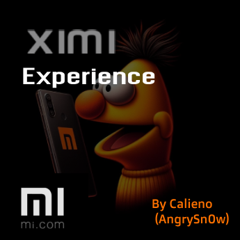
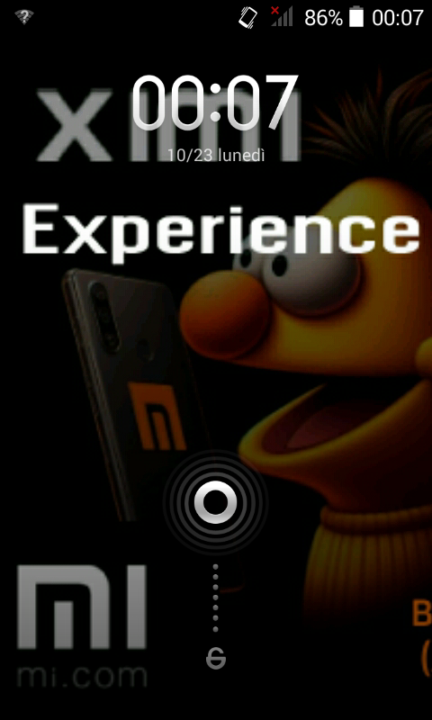
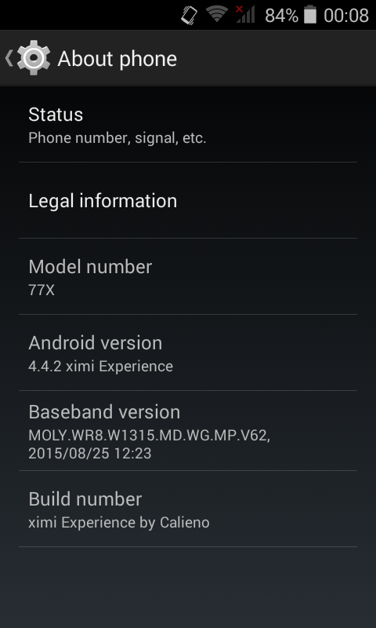

# XimiExperience
A fun and smooth custom rom for your Deco77x

* THIS ROM IS FOR 2015 KERNEL ONLY, I DO AM NOT RESPONSIBLE FOR ANY BRICKS ON 2016 KERNEL
  > To verify kernel version, go to __*settings > device info*__

 * Your warranty is now void.
 * We are not responsible for anything that may happen to your phone by installing any custom ROMs and/or kernels. 
 * You do it at your own risk and take the responsibility upon yourself and you are not to blame us or XDA and its respected developers.

## Basic informations
- **ROM Name:**  _XimiExperience_
- **Version:** 0.5 B
- **Release Date:** COMING SOON
- **Based on:** Stock rom (2015 kernel)

## **Description**
[based on Android 4.4.2]  
Due to my dissatisfaction with the [_**MIUI 7 PORT**_](https://www.androidiani.com/forum/modding-smartphone-altroconsumo/522845-miui-7-deco77x-port-bigboss97.html) on _Deco 77x_, i decided to make my own "miui-inspired" custom rom, 
using the [_**Stock + clockwork PHILZ**_](https://www.needrom.com/download/deco-77x-2/) as a base and deleting some more apps later via root

## **Key Features**
- degoogled
- no malware
- no unnecessary apps
- ximi launcher 😍
- no cringe boot animation
- DeoDexed
- performance tweaks

## **Installation Instructions**
* due to some technical changes, the rom is now recovery-only, therefore, the flashing method has changed completely
* the phone MUST HAVE a recovery already installed (preferrably Philz)

1. Boot into recovery
2. wipe
3. flash zip
4. flash superSU
5. reboot
6. enjoy  
**GAPPS ARE UNTESTED** (and also useless on android 4.4.2)

## **Known Issues**
- no app market yet (Aurora doesn't support android 4.4.2)
- you tell me

## **Changelog**
- Ximi bloatware removed
- duplicate system launcher remooved
- Google play services removed
- general stability improvements(debloat and other stuff)
- edited build.prop
- removed custom bootanimation in favor of stock
- created github page
- added images to github
- added wallpapers
- added performance tweaks to build.prop such as

persist.sys.purgeable_assets=1
ro.media.enc.hprof.vid.bps=8000000
ro.media.dec.jpeg.memcap=8000000
ro.media.enc.jpeg.quality=100
windowsmgr.support_rotation_270=true
windowsmgr.max_events_per_sec=150
debug.sf.hw=1
video.accelerate.hw=1
ro.ril.disable.power.collapse=1
pm.sleep_mode=1

## **Download**
* no download yet

## **Support and Discussions**
- No discussion group has been created yet

## **Acknowledgments** (special thanks)
- all of the contributors to the [**Androidiani thread for Deco 77x**](https://www.androidiani.com/forum/modding-smartphone-altroconsumo/507498-smartphone-altroconsumo-mt6572-modding.html)
- SP FLASH TOOL
- Philz recovery
- MIUI by Xiaomi
- MIUI 7 port for Deco 77x
- Federico cirillo (main sponsor for XimiExperience)
- my best friend Sofia (because yes)
- my other best friend chiara (also because yes)
- [_CPSTEST_](https://tiktok.com/@cpstest_) (for the ximi meme)
- itzznicholas (wallpapers and logos)

## SCREENSHOTS

## SOCIALS
[**TIKTOK**](https://tiktok.com/@tuttohomebrew)
