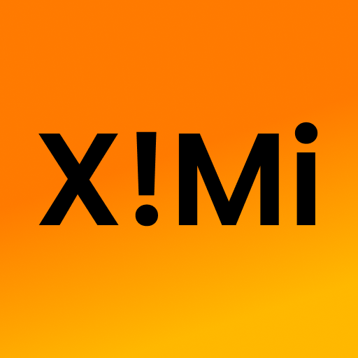

# XimiExperience
Originally created only for the Deco77x, XimiExperience is a custom rom that aims to bring the look and feel of old-school MIUI onto various devices I own, this is a hobby project created purely for fun, there's no guarantee I'll maintain it forever, this project was born due to my dissatisfaction with the MIUI 7 custom rom that was already developed for the Deco77x, and then branched into a complete project as time went on.

## FUTURE PLANS
- market
- recommended apps package (youtube client, browser etc)
- discussion server

## **Support and Discussions**
- No discussion group has been created yet

## **Acknowledgments** (special thanks)
- all of the contributors to the [**Androidiani thread for Deco 77x**](https://www.androidiani.com/forum/modding-smartphone-altroconsumo/507498-smartphone-altroconsumo-mt6572-modding.html)
- SP FLASH TOOL
- Philz recovery
- MIUI by Xiaomi
- MIUI 7 port for Deco 77x
- Federico cirillo (main sponsor for XimiExperience)
- my best friend Sofia (because yes)
- my other best friend chiara (also because yes)
- [_CPSTEST_](https://tiktok.com/@cpstest_) (for the ximi meme)
- itzznicholas (wallpapers and logos)

## SCREENSHOTS

## SOCIALS
[**TIKTOK**](https://tiktok.com/@homebrewkiddo)
